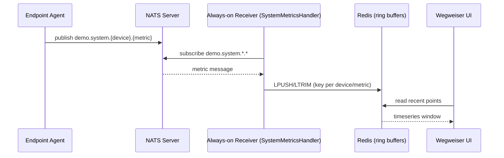
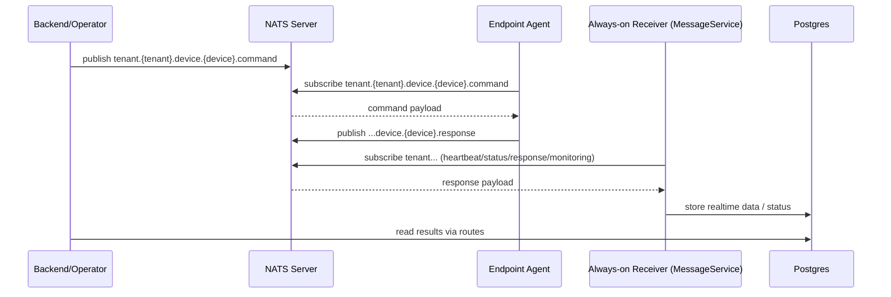

# Wegweiser NATS Dataflow: Endpoint → Backend → UI (Beginner Friendly)

This document explains, step by step, how data moves from the persistent agent running on an endpoint to the Wegweiser backend and into the UI. It assumes very little prior NATS knowledge.

---

## What is NATS (in 20 seconds)?
- NATS is a very fast messaging system used to send messages between components.
- Components publish messages to “subjects” (like channels). Others subscribe to those subjects.
- We use TLS (encryption) and per‑tenant subject scoping to keep data secure and isolated.
- JetStream (NATS’s persistence) can make messages durable and replayable when needed.

---

## Key actors in our system
- Endpoint Agent: downloads/nats_persistent_agent.py (runs on each device)
- NATS Server: tls://nats.wegweiser.tech:443 (subject‑based router)
- Always‑on Receiver: nats_receiver_runner.py (systemd service)
  - Tenant message service: app/handlers/nats/message_handlers.py
  - Demo metrics service: app/handlers/nats_demo/system_metrics.py
- Flask/Gunicorn Web App: serves UI and APIs, reads shared state (Redis)
- Redis: Temporary buffer for real‑time charts (cross‑process shared)

---

## Subject naming (channels)
We use two families of subjects:

1) Tenant‑scoped operational subjects (security‑sensitive)
- tenant.{tenant_uuid}.device.{device_uuid}.command
- tenant.{tenant_uuid}.device.{device_uuid}.response
- tenant.{tenant_uuid}.device.{device_uuid}.status.heartbeat
- tenant.{tenant_uuid}.device.{device_uuid}.monitoring

2) Demo real‑time metrics subjects (for charts on device page)
- demo.system.{device_uuid}.{metric_type}
  - metric_type examples: cpu_percent, memory_percent, disk_percent, network_bytes_in, network_bytes_out, uptime

The agent publishes heartbeats and responses on tenant subjects, and publishes demo metrics on demo.system.* subjects for the live charts.

---

## End‑to‑end flows

### A. Real‑time Metrics Flow (for device charts)
1) Agent collects metrics (psutil) and publishes messages to:
   - demo.system.{device_uuid}.{metric_type}
   - Payload example: { device_uuid, tenant_uuid, metric_type, value, timestamp_ms }
2) Always‑on Receiver subscribes to demo.system.*.* via SystemMetricsHandler
   - app/handlers/nats_demo/system_metrics.py subscribes once and runs forever
3) Handler stores points into Redis ring buffers
   - Key: wegweiser:metrics:{device_uuid}:{metric_type}
   - Operations: LPUSH (newest first), LTRIM (keep max N points), EXPIRE (TTL)
4) UI/API requests recent metrics
   - Flask route asks SystemMetricsHandler.get_recent_metrics()
   - It reads from Redis and returns a small time window (e.g., last 50–300 points)
5) UI renders charts instantly without hitting the database

Result: low‑latency, scalable, no cross‑process coupling. If Redis is down, an in‑process fallback buffer exists but is not shared across processes.

### B. Command/Response Flow (tenant‑scoped)
1) Backend publishes a command to agent
   - Subject: tenant.{tenant_uuid}.device.{device_uuid}.command
   - Payload contains command specification (e.g., run osquery)
2) Agent is subscribed to the command subject and executes it
3) Agent publishes response
   - Subject: tenant.{tenant_uuid}.device.{device_uuid}.response
   - Payload includes command_id, result, timestamps
4) Always‑on Receiver (NATSMessageService) validates tenant/device and stores structured data in DB (DeviceRealtimeData), or forwards to UI
5) UI retrieves results via normal Flask routes

### C. Heartbeat/Status Flow
1) Agent periodically publishes heartbeat
   - Subject: tenant.{tenant_uuid}.device.{device_uuid}.status.heartbeat
2) Always‑on Receiver updates connectivity (DeviceConnectivity) and device status fields
3) UI shows online/offline, last heartbeat, system info, etc.

---

## Why Redis for streaming charts (and not DB)?
- Streams can be high‑frequency. Writing every point to a relational DB causes write amplification and hot‑index churn.
- Redis lists act like a fast circular buffer for the most recent few hundred points per metric. Perfect for real‑time charts.
- We can still downsample to DB for long‑term analytics (see roadmap below).

Configuration (env vars used by SystemMetricsHandler):
- METRICS_REDIS_HOST=localhost
- METRICS_REDIS_PORT=6379
- METRICS_REDIS_DB=3
- METRICS_REDIS_PREFIX=wegweiser:metrics
- METRICS_MAX_POINTS=300 (per metric)
- METRICS_TTL_SECONDS=900 (15 minutes)

---

## Where things live in the repo
- Agent (example): downloads/nats_persistent_agent.py
- Always‑on runner: nats_receiver_runner.py
- Tenant message router/handlers: app/handlers/nats/message_handlers.py
- Demo metrics handler: app/handlers/nats_demo/system_metrics.py
- Web/UI consumes metrics via routes that call SystemMetricsHandler.get_recent_metrics()

---

## Systemd service (always‑on)
- Unit: /etc/systemd/system/wegweiser-nats-receiver.service
- Runs: /opt/wegweiser/nats_receiver_runner.py under a dedicated account (weg-nats-svc)
- Logs: journald + application log at wlog/wegweiser.log
- Purpose: decouple NATS listeners from web server lifecycle; starts on boot; restarts on failure.

---

## Diagrams (Mermaid)

### Real‑time Metrics

### Commands / Responses

---

## Operational checklist
- NATS receiver service is active:
  - systemctl status wegweiser-nats-receiver
  - journalctl -u wegweiser-nats-receiver -n 100
- Web app is active:
  - systemctl status wegweiser
- Redis is running:
  - systemctl status redis-server
- File logging writable:
  - wlog/wegweiser.log (service user needs write permission)

Troubleshooting tips:
- If charts are empty: confirm SystemMetricsHandler subscribed and Redis has keys (SCAN wegweiser:metrics:*)
- If service fails to start: check journald for Python path/env issues, and wlog permissions
- If agent does not receive commands: verify tenant/device UUIDs and subject names

---

## Roadmap: Phase 2 / Phase 3 options

Phase 2 (reliability and scale):
- Use JetStream durable consumers for tenant streams
  - Durable names per tenant/device; replay after outages
  - Queue groups for horizontal scaling of receivers
- Add backpressure and dead‑letter strategy (max redeliveries, parking)
- Prometheus/OpenTelemetry metrics for NATS receiver health
- WebSocket push from backend to UI for lower latency (optional)
- Stronger multi‑tenant isolation at NATS level
  - NKEYS/JWT accounts; per‑tenant subject ACLs and scoped creds

Phase 3 (analytics and long retention):
- Downsampling pipeline
  - From Redis/JetStream → 1‑minute aggregates → DB tables
  - Store avg/p50/p95/max per minute per metric
- Choose storage based on scale:
  - Postgres + TimescaleDB hypertables (compression + retention policies)
  - Or ClickHouse/InfluxDB/VictoriaMetrics for very large fleets
- Retention policies & cost control
  - Keep raw in Redis only a few minutes; keep 1‑min rollups for 30–90 days
- Advanced features
  - Anomaly detection on aggregates; health scores per device
  - Per‑tenant data export and scheduled reports (WeasyPrint PDFs)

---

## TL;DR
- Agents publish heartbeats and responses on tenant‑scoped subjects; demo charts use demo.system.*.* subjects.
- An always‑on service subscribes to both families and writes into DB (ops data) and Redis (chart data).
- UI reads recent metrics from Redis; historical analytics can be added via downsampling to DB.

